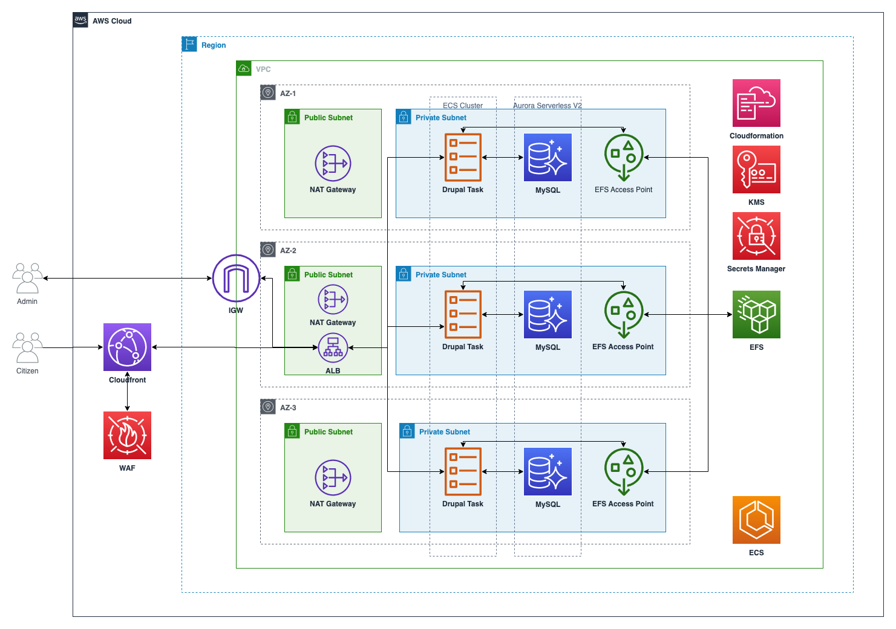

## AWS CDK - LocalGov Drupal

Welcome to the LocalGov Drupal CDK Stack

To Setup this application you will need the following prerequisites:
- https://docs.aws.amazon.com/cdk/v2/guide/getting_started.html#getting_started_prerequisites
- Git
- Docker
- AWS-CLI

Once you have these prerequisites in place you can complete the following tasks:

To manually create a virtualenv on MacOS and Linux:

```
$ python3 -m venv .venv
```

After the init process completes and the virtualenv is created, you can use the following
step to activate your virtualenv.

```
$ source .venv/bin/activate
```

If you are a Windows platform, you would activate the virtualenv like this:

```
% .venv\Scripts\activate.bat
```

Once the virtualenv is activated, you can install the required dependencies.

```
$ pip install -r requirements.txt
```

At this point you can now synthesize the CloudFormation template for this code.

```
$ cdk synth
```

If this is your first CDK deploy you will need to bootstrap the account (this configures the account for CDK deployments)
```
cdk bootstrap
```

Once this is complete and there have been no errors, you can deploy each of the stacks to your AWS Account
NOTE: If you'd like to do this without having to confirm the 3 stacks, you can use the command with parameter --require-approval never
```
$ cdk deploy --all --require-approval never
```

Once deployed you will be provided with URLs to access the site, by default the database credentials are injected into your settings.php so you do not need to configure this when installing.
```
DrupalFargateStack.FargateServiceServiceURL - The Application Load Balancer URL
DrupalWAFStack.CloudfrontDistribution - The root Cloudfront URL 
DrupalWAFStack.CloudfrontDistributionInstallPath - The install path (first install))
```

To terminate the stack, you can run the following command, this will remove all assets. You will need to confirm this in the command line
```
$ cdk destroy --all
```
## Architecture



## Useful commands

 * `cdk ls`          list all stacks in the app
 * `cdk synth`       emits the synthesized CloudFormation template
 * `cdk deploy`      deploy this stack to your default AWS account/region
 * `cdk diff`        compare deployed stack with current state
 * `cdk docs`        open CDK documentation

## Security

See [CONTRIBUTING](CONTRIBUTING.md#security-issue-notifications) for more information.

## License

This library is licensed under the MIT-0 License. See the LICENSE file.

